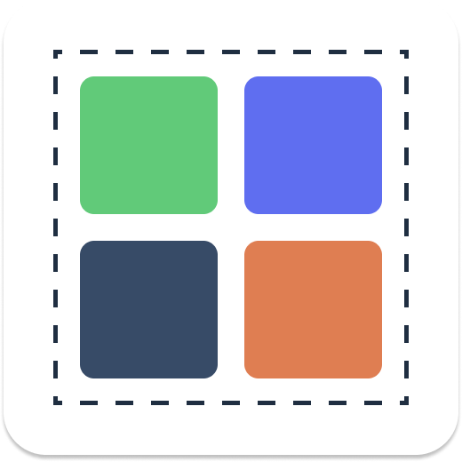
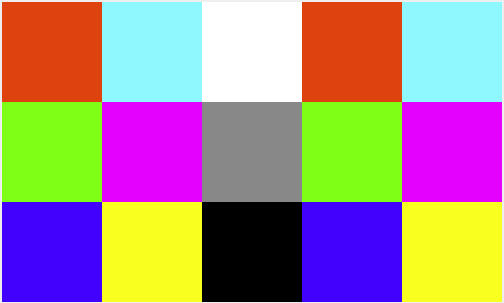

<p align="center"></p>
<h1 align="center">Compose Grid</h1>
<p align="center"><i>Missing grid layout for Jetpack Compose.</i></p>

**This project is under development.** But if you have a great idea for implementing grid, feel free
to create issue or pull request.

## Usage

There are 2 layout composable called `HorizontalGrid` and `VerticalGrid`. You can just place
children composables in the grid layout.

For instance, you can write code like below for grid of color boxes:

```kotlin
@Composable
fun ExampleGrid(colors: List<Color>) {
    HorizontalGrid(rowCount = 3) {
        for (color in colors) {
            Box(modifier = Modifier.size(100.dp).background(color))
        }
    }
}
```



## License

Compose Grid is licensed under Apache License 2.0. See [license file](./LICENSE.txt) for more details.
