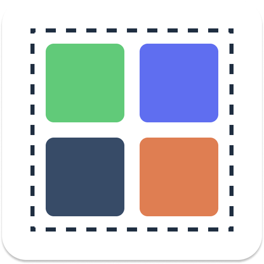
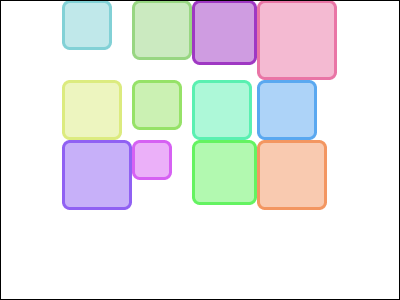
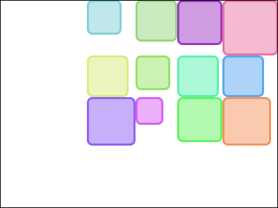
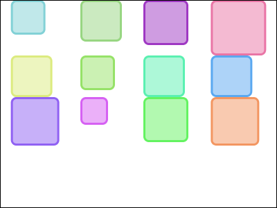
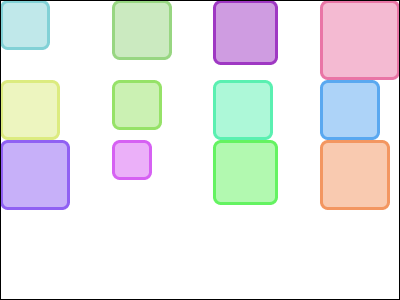
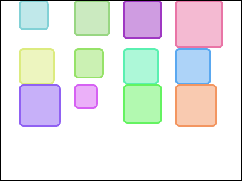
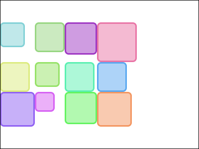
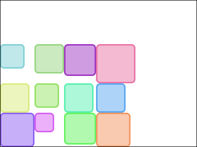
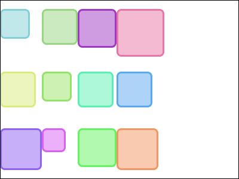
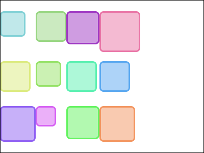

<p align="center"></p>
<h1 align="center">Grid Layout for Compose</h1>
<p align="center"><i>Missing grid layout for Jetpack Compose and Compose Multiplatform</i></p>

This library contains 2 layout composable called `HorizontalGrid` and `VerticalGrid`. Both layout
creates multiple rows and columns, but `HorizontalGrid` has fixed rows and `VerticalGrid`has fixed
columns. The grid layout places children as a line until the number of children is smaller than
main axis count (row count if horizontal, column count if vertical). But if the number of children
is over than main axis count, the grid places next children at the next line.

For instance, below code is an example of horizontal grid:

```kotlin
@Composable
fun ExampleGrid(colors: List<Color>) {
    HorizontalGrid(rowCount = 3) {
        for (color in colors) {
            Box(modifier = Modifier.size(100.dp).background(color))
        }
    }
}
```


## Installation

This library depends on Compose. It is recommended to use grid layout version that matches with your
project's compose version.

| GridLayout | Jetpack Compose (Android) | Compose Multiplatform |
|------------|---------------------------|-----------------------|
| 0.1.x      | 1.4.3                     | 1.4.1                 |

To download `gridlayout-compose`, add this library to your project's dependency:

```groovy
dependencies {
    implementation("io.woong.compose.grid:grid:${version}")
}
```

## Features

`HorizontalGrid` and `VerticalGrid` have following features.

### Arrangement

The grid layout have `horizontalArrangement` and `verticalArrangement` parameter that controls
the way to place children and determine space between children. The default horizontal arrangement
is `Arrangement.Start` and the default vertical arrangement is `Arrangement.Top`.

The following shows types of `horizontalArrangement`:

| Horizontal Arrangement   | Example                                                                                    |
|--------------------------|--------------------------------------------------------------------------------------------|
| Arrangement.Start        |                  |
| Arrangement.Center       |                |
| Arrangement.End          |                      |
| Arrangement.SpaceAround  |    |
| Arrangement.SpaceBetween |  |
| Arrangement.SpaceEvenly  |    |

And the following shows types of `verticalArrangement`:

| Vertical Arrangement     | Example                                                                                |
|--------------------------|----------------------------------------------------------------------------------------|
| Arrangement.Top          |                      |
| Arrangement.Center       |                |
| Arrangement.Bottom       |                |
| Arrangement.SpaceAround  |    |
| Arrangement.SpaceBetween |  |
| Arrangement.SpaceEvenly  |    |

## Sample App

This project contains sample app for Android and Desktop platform. You can see how the grid layout
actually works with options. Checkout `sample-android` and `sample-desktop` directory.

## License

Compose Grid is licensed under Apache License 2.0. See [license file](./LICENSE.txt) for more details.
