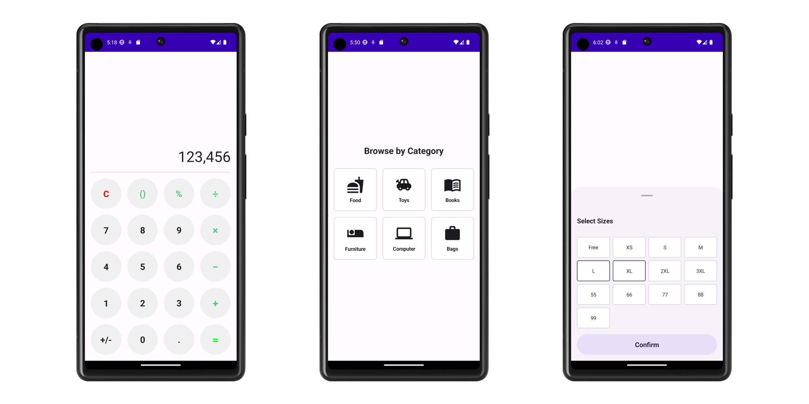
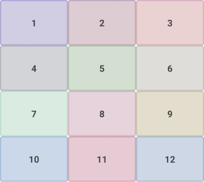

# GridLayout for Compose

[](https://github.com/cheonjaeung/gridlayout-compose/actions/workflows/ci.yml)

[](https://github.com/cheonjaeung/gridlayout-compose/blob/main/LICENSE.txt)

GridLayout for Compose is a library that provides missing non-lazy grid layout composables for Compose Multiplatform.



Jetpack Compose doesn't offer non-lazy grid layouts, providing only lazy grids and alternatives (e.g., flow layouts).
However, sometimes we need a simple grid layout for less complexity and more intuitive layout code.
This library offers sequential grid, and box grid as simpler solutions for small grid UIs.

There are benefits of this library:

- **Similar API to LazyGrid**: The GridLayout's APIs are designed to provide similar development experience to LazyGrid.
- **Easy to implement various grid**: There are _"Fixed"_, _"Adaptive"_ and _"FixedSize"_ for grid layout management like LazyGrid.
  Like LazyGrid, it eliminates dealing with different screen sizes.
- **Simple to use as a part of LazyList**: The GridLayout is not lazy layout. It can be simply placed in lazy layouts.
  If only a portion of the full layout is grid, No need to use LazyGrid with span size for full layout.
- **Efficient for small datasets**: LazyGrid has complex logics for large datasets. But when datasets are small, it can be inefficient.
  The GridLayout is just a simple layout. It can be more efficient for smaller datasets.
- **Flexible item placement**: This library provide `BoxGrid` layout to allow placing items at the specific row and column position.

## Installation

To download this library, add dependency to your gradle:

```groovy
dependencies {
    implementation("com.cheonjaeung.compose.grid:grid:<version>")
}
```

**After the 2.0.0 version, the group id and package name is changed from**
**`io.woong.compose.grid` to `com.cheonjaeung.compose.grid`.**

## Usage



```kotlin
VerticalGrid(
    columns = SimpleGridCells.Fixed(3),
    modifier = Modifier.fillMaxWidth(),
) {
    for ((index, color) in colors.withIndex()) {
        ColorBox(
            modifier = Modifier,
            color = color,
            text = (index + 1).toString(),
        )
    }
}
```

For more information, please visit [documentation](https://cheonjaeung.github.io/gridlayout-compose/) site.

## Building

This project is kotlin multiplatform project.
It's recommended to setup kotlin multiplatform developement environment.

### Samples

This project contains sample app project in the `samples` directory.
You can run sample app both Andorid and iOS (iOS sample app can run only on the macOS).

### Testing

This project has unit tests and snapshot tests.
Run following command to run all tests:

```shell
./gradlew :grid:test
```

To run only snapshot tests, run following command:

```shell
./gradlew :grid:verifyPaparazziDebug
```

If you add or edit snapshot tests, run following command to create new snapshots:

```shell
./gradlew :grid:recordPaparazziDebug
```

If test is failed, you can check what is wrong from diff images.
The diff images are generated in `grid/build/paparazzi/failures/` with `delta-*` name.

### Binary Compatibility

This project runs public binary API compatibility validation on CI.
If you change public APIs, run following command before commit:

```shell
./gradlew apiDump
```

And you should commit api files with your code changes.

## Contributing

Welcome to contribute to this project!
Feel free to create pull requests or issues.

- **Patching**: If you want to change code, make a pull request.
- **Bug Reporting**: If you think something is wrong, make an issue and add the **bug** label.
- **Feature Requesting**: If you want to request some features, make an issue and add the **enhancement** label.
- **Questions**: If you have some questions, make an issue and add the **question** label.

## Changelog

Please see [changelog](./CHANGELOG.md) file.

## License

```
Copyright 2023 Cheon Jaeung

Licensed under the Apache License, Version 2.0 (the "License");
you may not use this file except in compliance with the License.
You may obtain a copy of the License at

    https://www.apache.org/licenses/LICENSE-2.0

Unless required by applicable law or agreed to in writing, software
distributed under the License is distributed on an "AS IS" BASIS,
WITHOUT WARRANTIES OR CONDITIONS OF ANY KIND, either express or implied.
See the License for the specific language governing permissions and
limitations under the License.
```

GridLayout for Compose is licensed under Apache License 2.0. See [license file](./LICENSE.txt) for more details.
