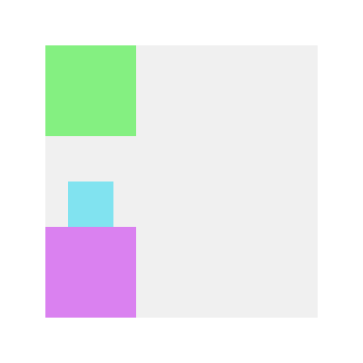

# Alignment

All grid layout composables have a `content` lambda parameter.
In this `content`, items can have the `align` modifier.

The `align` modifier set the item composable's alignment in the cell.
`align` takes an `Alignment` likes `BoxScope`'s one.
For example, you can set an item composable at the bottom-center of the cell with following code:

```Kotlin
HorizontalGrid(
    modifier = Modifier.fillMaxSize(),
    rows = SimpleGridCells.Fixed(3)
) {
    Item(Modifier.size(100.dp))

    Item(
        modifier = Modifier
            .size(50.dp)
            .align(Alignment.BottomCenter)
    )

    Item(Modifier.size(100.dp))
}
```

```kotlin
BoxGrid(
    modifier = Modifier.fillMaxSize(),
    rows = SimpleGridCells.Fixed(3),
    columns = SimpleGridCells.Fixed(3)
) {
    Item(Modifier.size(100.dp))

    Item(
        modifier = Modifier
            .row(1)
            .size(50.dp)
            .align(Alignment.BottomCenter)
    )

    Item(
        modifier = Modifier
            .row(2)
            .size(100.dp)
    )
}
```


