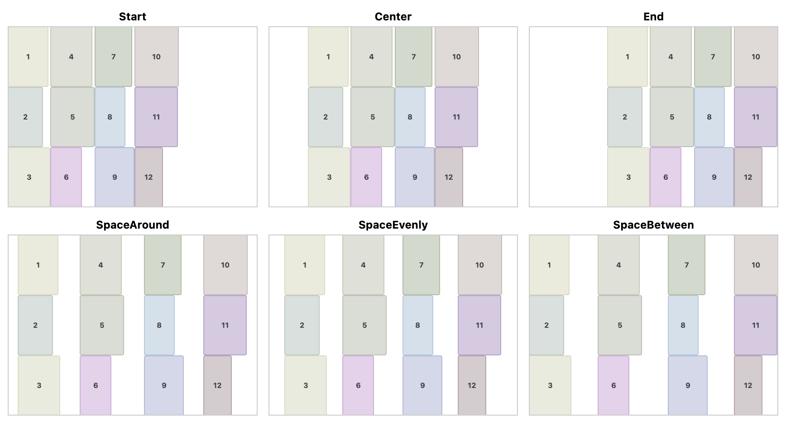
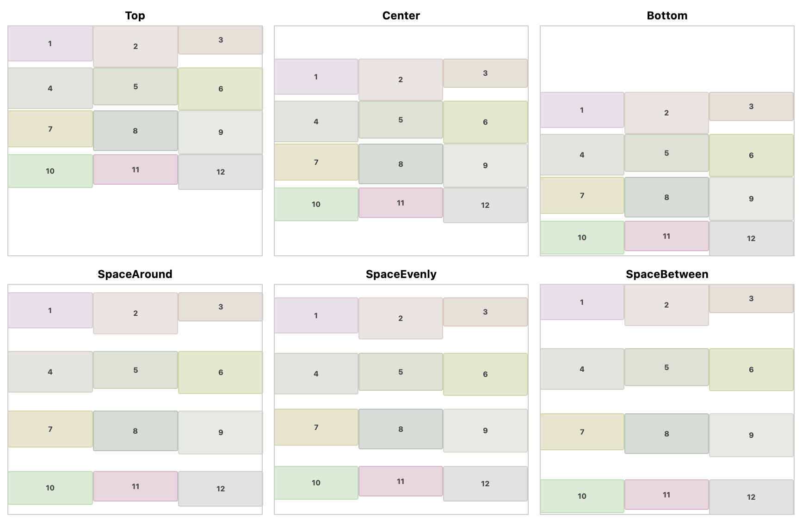

# Arrangement

Both `VerticalGrid` and `HorizontalGrid` have `horizontalArrangement` and `verticalArrangement` parameter.
The default value is `Arrangement.Start` and `Arrangement.Top`.
You can use basic arrangement options like `Start`, `Center`, `End`, `Top`, `Bottom` and `SpaceAround`, `SpaceEvenly`, `SpaceBetween`.
And also you can use `spacedBy` for spacing each cell.

## HorizontalArrangement

Following image is a sample of horizontal arrangement for `HorizontalGrid`.

## VerticalArrangement

Following image is a sample of vertical arrangement for `VerticalGrid`.

