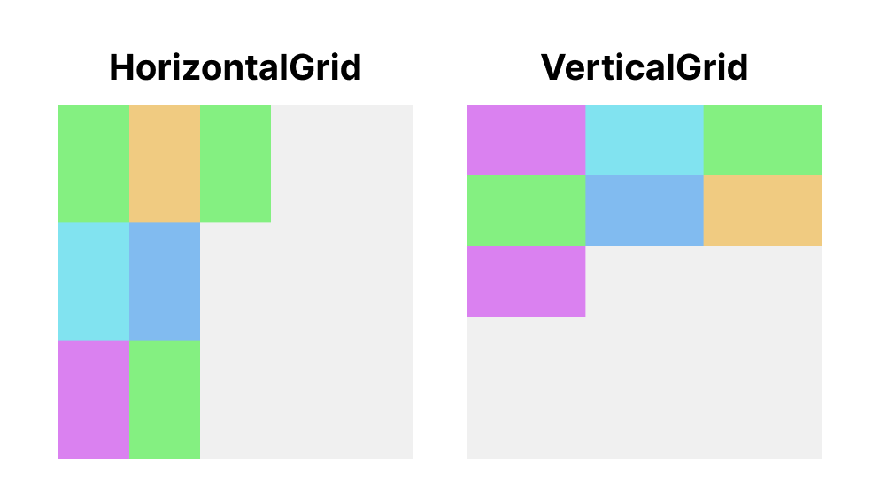
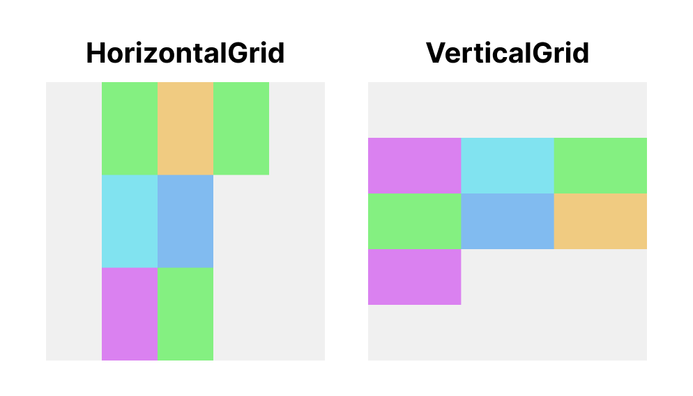
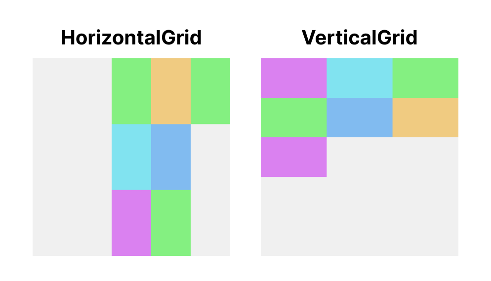
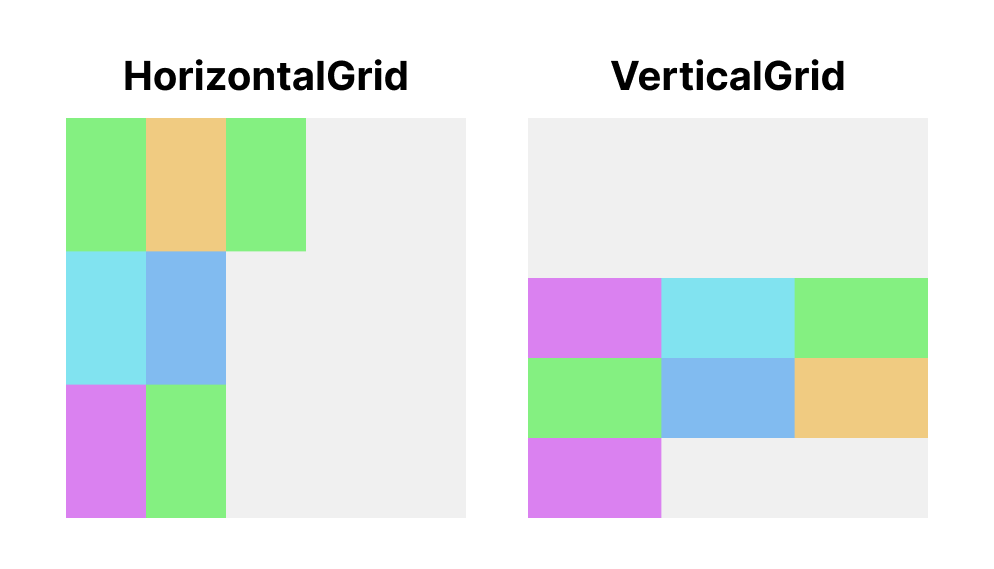
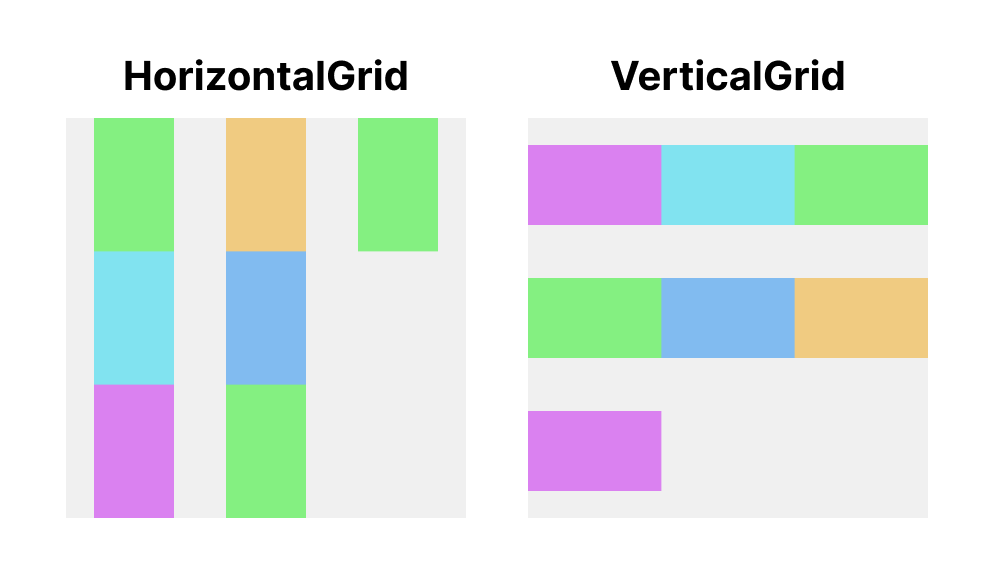
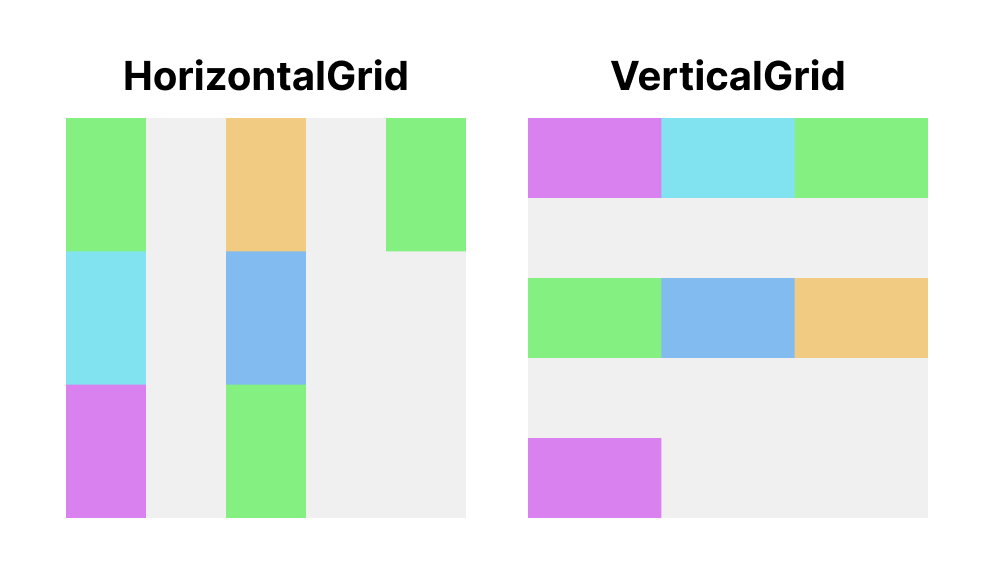
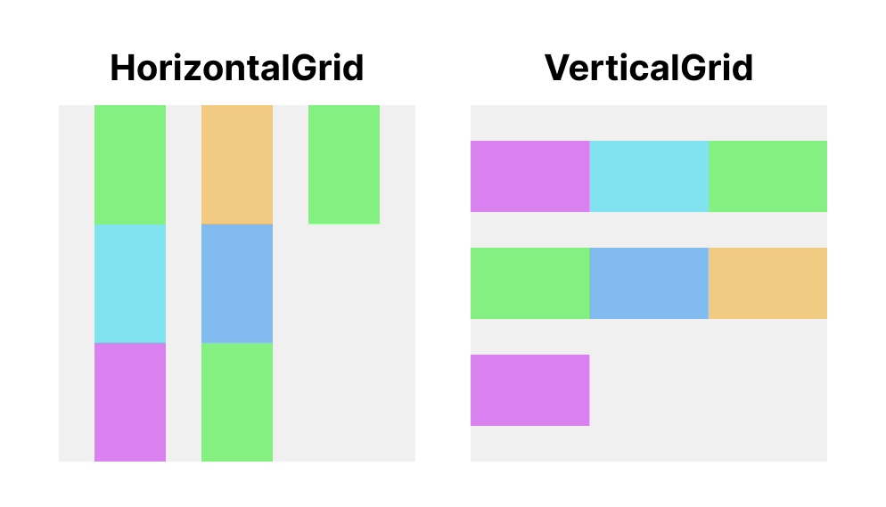
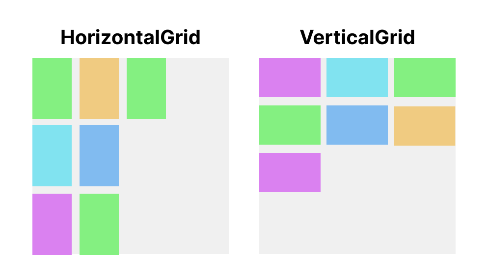

# Arrangement

`HorizontalGrid` and `VerticalGrid` have arrangement parameters called `horizontalArrangement` and `verticalArrangement`.
`Arrangement` determines how the grid cells are arranged or the spacing between cells.
`horizontalArrangement` arrange the cells in the horizontal axis direction, and `verticalArrangement` arrange in vertical axis direction.

GridLayout supports all of built in `Arrangement` types, `Start`, `Center`, `End`, `Top`, `Bottom`,
`SpaceAround`, `SpaceEvenly`, `SpaceBetween`, `spacedBy` and all other types including custom `Arrangement`.

## Basic Arrangements

Following graphics show differences of arrangement types.
Graphics are based on LTR (Left to Right) direction.
If the layout direction is RTL (Right to Left), the `Arrangement.Start` and `Arrangement.End` will be reversed.

### Start

`Arrangement.Start` is available for `horizontalArrangement`.
It places cells to the beginning of the horizontal axis.

### Top

`Arrangement.Top` is available for `verticalArrangement`.
It places cells to the top of the vertical axis.

### Center

`Arrangement.Center` is available for both `horizontalArrangement` and `verticalArrangement`.
It places cells to the middle of axis.

### End

`Arrangement.End` is available for `horizontalArrangement`.
It places cells to the end of horizontal axis.

### Bottom

`Arrangement.End` is available for `verticalArrangement`.
It places cells to the bottom of vertical axis.

## Spacing Between Cells

Following graphics show some arrangement types for spacing between cells.

### SpaceAround

`Arrangement.SpaceAround` is available for both `horizontalArrangement` and `verticalArrangement`.
It places cells with spacing.
The spacing between two cells have same amount.
But the spacing before the first cell and after the last cell have a half of spacing between two cells.

### SpaceBetween

`Arrangement.SpaceBetween` is available for both `horizontalArrangement` and `verticalArrangement`.
It places cells with same spacing excluding before the first cell and after the last cell.

### SpaceEvenly

`Arrangement.SpaceEvenly` is available for both `horizontalArrangement` and `verticalArrangement`.
It places cells with spacing.
It places cells with same spacing including before the first cell and after the last cell.

### SpacedBy

`Arrangement.spacedBy()` is available for both `horizontalArrangement` and `verticalArrangement`.
It places cells with fixed amount of spacing.
The spacing is not applied to the before the first cell and after the last cell.
