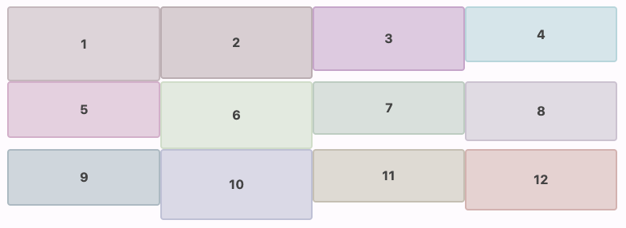
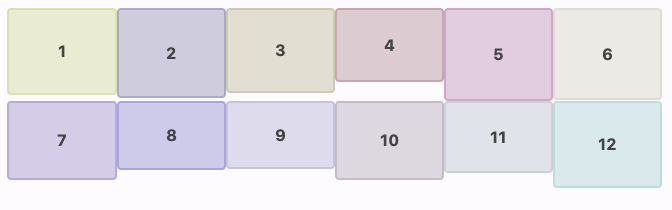

# Cell Strategy

Both grid layout composables take a cell strategy parameter called `SimpleGridCells`.
`SimpleGridCells` defines the number of cells and the size of each cell.

There are 2 types of cell strategy, `Fixed` and `Adaptive`.
They are similar to LazyGrid's `Fixed` and `Adaptive`.

## Fixed

`SimpleGridCells.Fixed` is a cell strategy for exact count of rows or columns.
And each cell will have 1/n of the grid size.

For example, `Fixed(4)` means that the grid should have 4 cells.
If the grid width is 400dp, each cell have 100dp width.
If `Fixed(4)` is applied to `VerticalGrid`, the grid will be like this:

```kotlin
VerticalGrid(
    columns = SimpleGridCells.Fixed(4),
    modifier = Modifier.width(400.dp)
) { /* content */ }
```



## Adaptive

`SimpleGridCells.Adaptive` is a cell strategy for as many cells as possible.
And each cell will have at least minimum size.

For example, when `Adaptive(60.dp)` is applied to `VerticalGrid` with 400dp width.
The number of cells will be 6 and the size of each cell will be about 66.666...dp.
Because 6 is the maximum count of cells as long as it kept minimum size.
(When the number of cells is 7, each cell size will be about 57.1dp.
It is smaller than minimum size.)

```kotlin
VerticalGrid(
    columns = SimpleGridCells.Adaptive(60.dp),
    modifier = Modifier.width(400.dp)
) { /* content */ }
```


