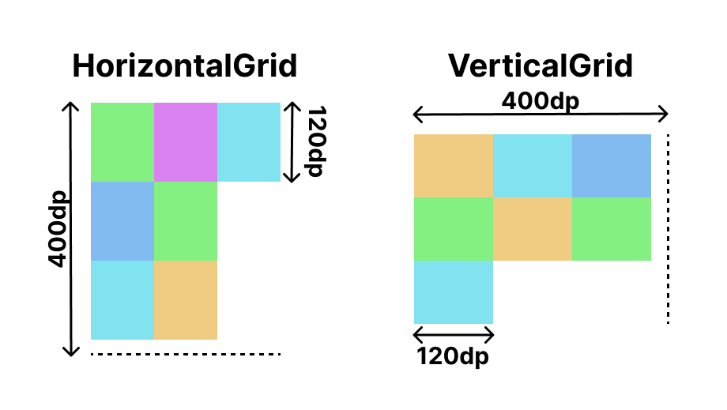

# Cell Strategy

All grid layout composables take a cell strategy parameter called `SimpleGridCells`.
`SimpleGridCells` defines the number of cells and the size of each cell.

There are several types of cell strategy, `Fixed`, `Adaptive` and `FixedSize`.
They are similar to LazyGrid's `GridCells.Fixed`, `GridCells.Adaptive` and `GridCells.FixedSize`.

## Fixed

`SimpleGridCells.Fixed` is a cell strategy for exact count of rows or columns.
And each cell will have 1/n of the grid size.

The API of `Fixed` looks like this:

```kotlin
class Fixed(
    private val count: Int,
    private val fill: Boolean = true
) : SimpleGridCells
```

There is a parameter called `count`. This is the maximum number of cells the grid should have on
each line. The `count` must be a positive number. If 0 or negative number is provided, it occurs
an exception.

!!! note
    For information about `fill` parameter, read [Fill Optoin](#fill-option) section.

For example, a grid has 400dp width or height, and `Fixed(4)` is applied.

```kotlin
HorizontalGrid(
    rows = SimpleGridCells.Fixed(4),
    modifier = Modifier.height(400.dp)
) { /* content */ }

VerticalGrid(
    columns = SimpleGridCells.Fixed(4),
    modifier = Modifier.width(400.dp)
) { /* content */ }
```


The grid will have 4 cells on each line.
If the grid is horizontal, it will have 4 rows and if vertical, it will have 4 columns.
And each cells should have 1/n of the grid size.
In this example, each cells will have 100dp width or height.

## Adaptive

`SimpleGridCells.Adaptive` is a cell strategy for as many cells as possible.
And each cell will have at least minimum size.

The API of `Adaptive` looks like this:

```kotlin
class Adaptive(
    private val minSize: Dp,
    private val fill: Boolean = true
) : SimpleGridCells
```

There is a parameter called `minSize`. This is the minimum size of each cell should have.
The `minSize` must be a positive size. If the size is 0 or below, it occurs an exception.
The grid layout with `Adaptive` calculates the maximum number of cells possible while keeping
the `minSize` restriction.

!!! note
    For information about `fill` parameter, read [Fill Option](#fill-option) section.

For example, a grid has 400dp width or height and `Adaptive(120.dp)` is applied.

```kotlin
HorizontalGrid(
    rows = SimpleGridCells.Adaptive(120.dp),
    modifier = Modifier.height(400.dp)
) { /* content */ }

VerticalGrid(
    columns = SimpleGridCells.Adaptive(120.dp),
    modifier = Modifier.width(400.dp)
) { /* content */ }
```


The grid will calculate how many cells should have.
In this case, the grid will have 3 cells on each line.
Because, there is no way to have 4 or more cells while keeping `minSize` restriction.
And each cells will have 1/3 of 400dp (about 133.333dp) width or height.

If the grid size is expanded to 600dp, the number of cells on each line will be changed to 5
and each cell's size will be 120dp.

## FixedSize

`SimpleGridCells.FixedSize` is a cell strategy for as many cells as possible with exact size.

!!! example "Experimental"
    This cell strategy is currently **experimental**. You should use it with `@ExperimentalGridApi` annotation to opt-in.

The API of `FixedSize` looks like this:

```kotlin
class FixedSize(
    private val size: Dp,
    private val fill: Boolean = true
) : SimpleGridCells
```

There is a parameter called `size`. This is the size of each cell should have.
The `size` must be a positive size. If the size is 0 or below, it occurs an exception.
If the `size` is bigger than container's size, the cell will have the same size to the container.

!!! note
    For information about `fill` parameter, read [Fill Option](#fill-option) section.

For example, a grid has 400dp width or height and `FixedSize(120.dp)` is applied.

```kotlin
HorizontalGrid(
    rows = SimpleGridCells.FixedSize(120.dp),
    modifier = Modifier.height(400.dp)
) { /* content */ }

VerticalGrid(
    columns = SimpleGridCells.FixedSize(120.dp),
    modifier = Modifier.width(400.dp)
) { /* content */ }
```



The grid will have 3 cells on each line and the remaining space will not be used.
If the grid size is expanded to 600dp, the number of cells on each line will be changed to 5.

In other case, `FixedSize(300.dp)` for `VerticalGrid(Modifier.width(200.dp))` means that there
will be only one column and the cell will have 200dp width.

## Fill Option

All cell strategy classes have a optional parameter named `fill`.
The `fill` parameter determines that grid's item composable should fill grid cell's size.

When `fill` is true, grid layout forces item composable to have width or height to fit cell's maximum width or height.
(width when vertical grid, height when horizontal grid)
But when false, item composable can have width or height from 0 to cell's maximum width or height.
This allows an item to be aligned within a cell, instead of being forced to fill it.
