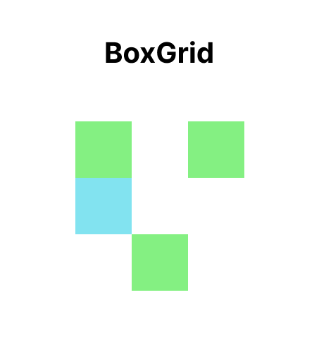
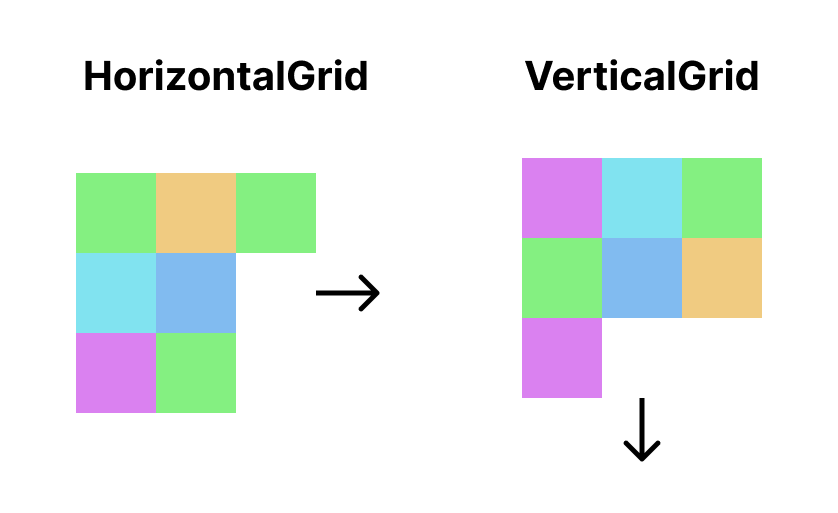
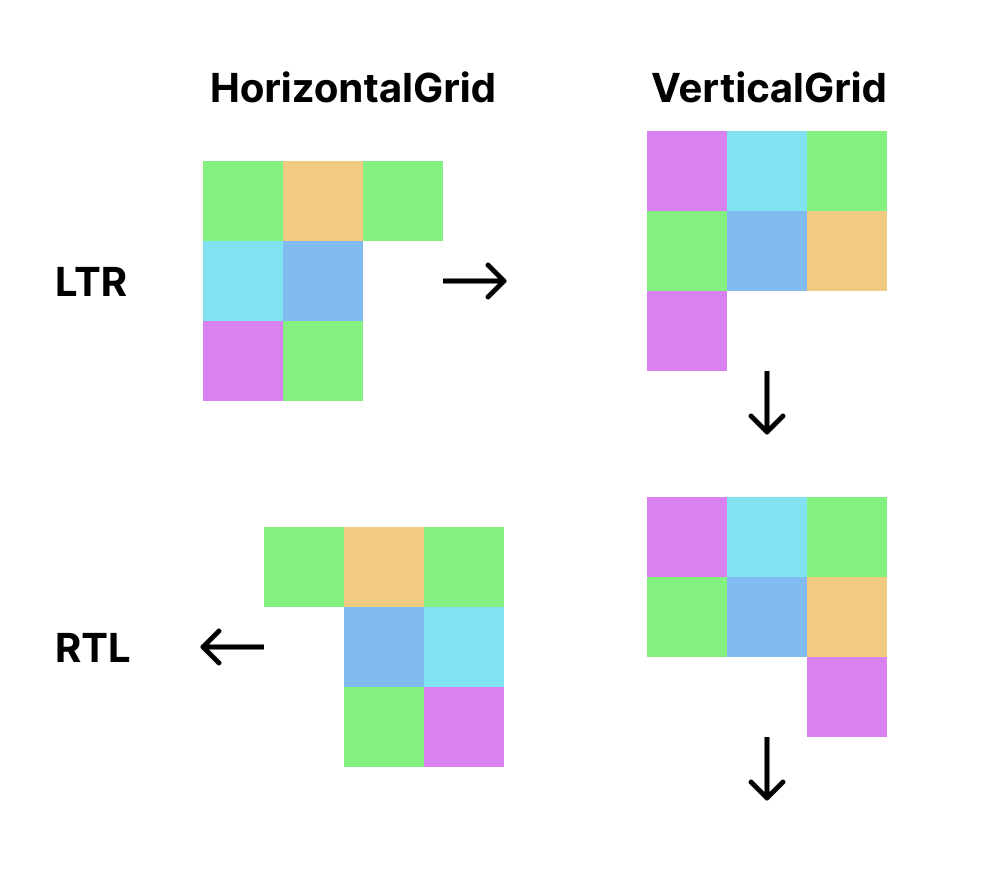

# Layout Composables

## Box Grid

GridLayout library provides `BoxGrid` composable.
`BoxGrid` is a grid layout composable that allows you to place items in grid format.
Like `Box` composable, items in `BoxGrid` can be placed in any position.



In the `BoxGrid`, each item can have `Modifier.row` and `Modifier.column` to specify the cell position.
If `row` or `column` is not provided, it considered as 0.

```kotlin
BoxGrid(
    modifier = Modifier.fillMaxSize(),
    rows = SimpleGridCells.Fixed(3),
    columns = SimpleGridCells.Fixed(3),
) {
    // It will be placed at 0, 0.
    Item()

    // It will be placed at 0, 1.
    Item(modifier = Modifier.row(1))

    // It will be placed at 1, 2.
    Item(modifier = Modifier.position(row = 2, column = 1))

    // It will be placed at 2, 0.
    Itme(modifier = Modifier.column(2))
}
```

!!! note
    You can see `rows` and `columns` parameter for `BoxGrid`.
    This parameters are required parameter for grid layout.
    For details, see [cell strategy](./cell-strategy.md) section.

## Sequential Grid

GridLayout library also provides sequential grid composables, `HorizontalGrid` and `VerticalGrid`.
These composables place items sequentially in a grid format.

GridLayout library provides a simple API to make grid UI.
And also this library's grids have similar API to lazy grids.
If you have used LazyGrid, you can use this library more easily.



Basically, there are 2 composables to make grid, `HorizontalGrid` and `VerticalGrid`.
`HorizontalGrid` is a grid layout composable that increases its width as items increases
and `VerticalGrid` increases its height as items increases.

The following sample code shows how to use these grid layout composables.

```kotlin
HorizontalGrid(
    rows = SimpleGridCells.Fixed(3),
    modifier = Modifier.fillMaxHeight()
) {
    // It will be placed at 0, 0.
    Item()

    // It will be placed at 0, 1.
    Item()

    // It will be placed at 0, 2.
    Item()

    // It will be placed at 1, 0.
    Item()
}

VerticalGrid(
    columns = SimpleGridCells.Fixed(3),
    modifier = Modifier.fillMaxWidth()
) {
    // It will be placed at 0, 0.
    Item()

    // It will be placed at 1, 0.
    Item()

    // It will be placed at 2, 0.
    Item()

    // It will be placed at 0, 1.
    Item()
}
```

!!! note
    You can see `rows` and `columns` parameter for `HorizontalGrid` and `VerticalGrid`.
    This parameter is required parameter for grid layout.
    For details, see [cell strategy](./cell-strategy.md) section.

### Fill Max Main Axis Size

`HorizontalGrid` and `VerticalGrid` support `fillMaxMainAxisSize` modifier.
This modifier makes the item have the same size to the maximum of the main axis sizes in the line.
It is useful when you want to make all items in the same line have the same size.

!!! example "Experimental"
    This modifier is currently **experimental**. You should use it with `@ExperimentalGridApi` annotation to opt-in.

```kotlin
HorizontalGrid(rows = SimpleGridCells.Fixed(3)) {
    // This item determines the max size of the column.
    Item(modifier = Modifier.size(100.dp))

    // This item will be expanded to 100.dp height.
    Item(modifier = Modifier.fillMaxMainAxisSize())
}
```

## RTL (Right to Left) Supports



GridLayout supports RTL layout direction. Grids check current layout direction and places items by
direction.

If you want to apply a specified layout direction manually, wrap grid layout with `CompositionLocalProvider` and
provide `LocalLayoutDirection` like following code:

```kotlin
CompositionLocalProvider(LocalLayoutDirection provides LayoutDirection.Rtl) {
    HorizontalGrid(
        rows = SimpleGridCells.Fixed(3),
        modifier = Modifier.fillMaxHeight()
    ) { /* content */ }
}
```
