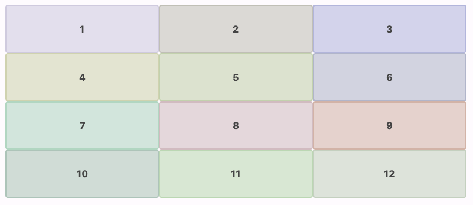
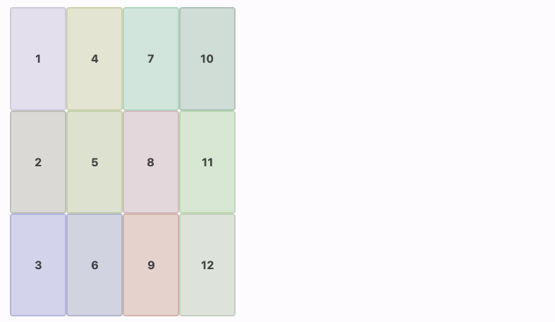

# Grid Layout Composables

There are 2 layout composables, `VerticalGrid` and `HorizontalGrid`.
Both composables have same behavior but different directions.

`VerticalGrid` places item rows from top to bottom.
The grid places items from left to right (when RTL, right to left) until the row is filled.
After the row is filled, the grid places next item at the next row.
The next row will be placed at the bottom of the previous row.

The following code sample shows an example of vertical grid.

```kotlin
VerticalGrid(
    columns = SimpleGridCells.Fixed(3),
    modifier = Modifier.fillMaxWidth(),
) {
    for ((index, color) in colors.withIndex()) {
        ColorBox(
            color = color,
            text = (index + 1).toString(),
        )
    }
}
```



`HorizontalGrid` has similar behavior but for different direction.
`HorizontalGrid` place item columns from left to right (when RTL, right to left).
The grid places item from top to bottom until the column is filled.
After the columns is filled, the grid places next item at the next column.
The next column will be places at the right (when RTL, left) of the previous column.

The following code sample shows an example of horizontal grid.

```kotlin
HorizontalGrid(
    rows = SimpleGridCells.Fixed(3),
    modifier = Modifier.fillMaxHeight(),
) {
    for ((index, color) in colors.withIndex()) {
        ColorBox(
            color = color,
            text = (index + 1).toString(),
        )
    }
}
```


