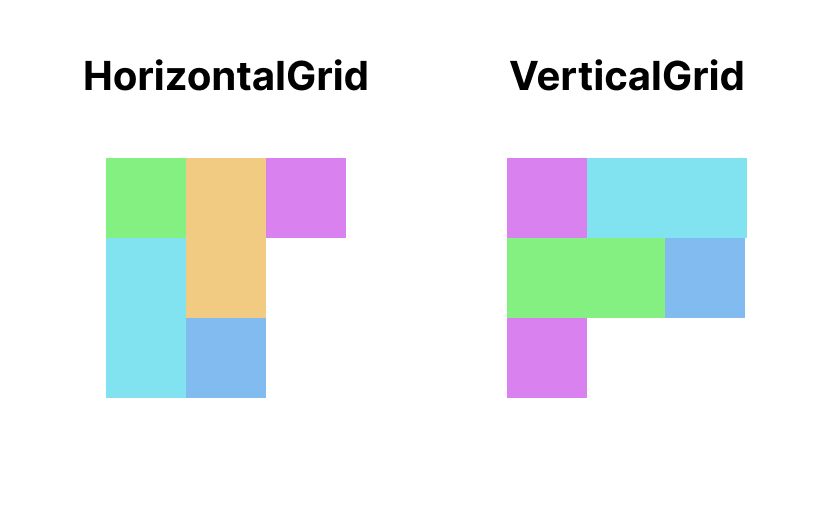

# Spanning Cells

The `content` composable lambda of grid layout extends `GridScope`.
To apply span size, you can set `span` modifier in the `GridScope`.

The `span` modifier takes a lambda to calculate span of item.
In the lambda, you can calculate a span size and return it.
The following code and graphic show an example of span.

!!! warning
    If returned span size is bigger than maximum cell count of the axis, the cell will be undisplayed.

```kotlin
HorizontalGrid(rows = SimpleGridCells.Fixed(3)) {
    Item()
    Item(Modifier.span { 2 })
    Item(Modifier.span { 2 })
    Item()
    Item()
}

VerticalGrid(columns = SimpleGridCells.Fixed(3)) {
    Item()
    Item(Modifier.span { 2 })
    Item(Modifier.span { 2 })
    Item()
    Item()
}
```



The scope of lambda parameter is called `GridItemSpanScope`.
In the `GridItemSpanScope`, you can access to information of current line via `maxLineSpan` and `maxCurrentLineSpan`.

`maxLineSpan` is the same to cross axis cell count.
If a vertical grid has 4 columns, the `maxLineSpan` is 4.

`maxCurrentLineSpan` is current usable cell count.
If a vertical grid has 4 columns and already one cell is filled, the `maxCurrentLineSpan` is 3.

The following code is an example of the span calculation with span information.

```kotlin
VerticalGrid(columns = SimpleGridCells.Adaptive(30.dp)) {
    for (i in 0 until itemCount)
    Item(
        modifier = Modifier.span {
            if (maxLineSpan == maxCurrentLineSpan) {
                maxLineSpan - i
            } else {
                maxCurrentLineSpan
            }
        }
    )
}
```

There is a convenience modifier that just takes an integer span.

!!! warning
    Span with an integer parameter is deprecated after 2.3.0.
    Replace it to the span with lambda parameter.

```kotlin
HorizontalGrid(rows = SimpleGridCells.Fixed(3)) {
    Item()
    Item(Modifier.span(2))
    Item(Modifier.span(2))
    Item()
    Item()
}

VerticalGrid(columns = SimpleGridCells.Fixed(3)) {
    Item()
    Item(Modifier.span(2))
    Item(Modifier.span(2))
    Item()
    Item()
}
```
