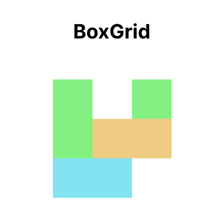
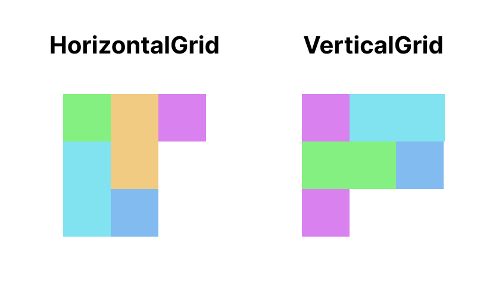

# Spanning Cells

The `content` composable lambda of grid layout extends `BoxGridScope`.
In the `BoxGridScope`, you can use `rowSpan` and `columnSpan` modifier to set span size of cell.

The `span` modifiers take a lambda to calculate spans.
The lambda returns a `BoxGridItemSpan` which represents row and column span size.
Or you can just pass `null` instead of lambda to use default span size, which is 1.

```kotlin
BoxGrid(
    rows = SimpleGridCells.Fixed(3),
    columns = SimpleGridCells.Fixed(3)
) {
    Item(modifier = Modifier.span { BoxGridItemSpan(row = 2) })
    Item(modifier = Modifier.column(2))
    Item(modifier = Modifier.position(row = 1, column = 1).span { BoxGridItemSpan(column = 2) })
    Item(modifier = Modifier.row(2)span { BoxGridItemSpan(column = 2) })
}
```



`HorizontalGrid` and `VerticalGrid` are also available to set span size.
The `content` composable lambda of grid layout extends `GridScope`.
To apply span size, you can set `span` modifier in the `GridScope`.
Like `BoxGridScope`'s `rowSpan` and `columnSpan`, the `span` modifier takes a lambda to calculate span.

!!! warning
    If returned span size is bigger than maximum cell count of the axis, the cell will be undisplayed.

```kotlin
HorizontalGrid(rows = SimpleGridCells.Fixed(3)) {
    Item()
    Item(Modifier.span { 2 })
    Item(Modifier.span { 2 })
    Item()
    Item()
}

VerticalGrid(columns = SimpleGridCells.Fixed(3)) {
    Item()
    Item(Modifier.span { 2 })
    Item(Modifier.span { 2 })
    Item()
    Item()
}
```



The scope of lambda parameter is called `GridItemSpanScope`.
In the `GridItemSpanScope`, you can access to information of current line via `maxLineSpan` and `maxCurrentLineSpan`.

`maxLineSpan` is the same to cross axis cell count.
If a vertical grid has 4 columns, the `maxLineSpan` is 4.

`maxCurrentLineSpan` is current usable cell count.
If a vertical grid has 4 columns and already one cell is filled, the `maxCurrentLineSpan` is 3.

The following code is an example of the span calculation with span information.

```kotlin
VerticalGrid(columns = SimpleGridCells.Adaptive(30.dp)) {
    for (i in 0 until itemCount)
    Item(
        modifier = Modifier.span {
            if (maxLineSpan == maxCurrentLineSpan) {
                maxLineSpan - i
            } else {
                maxCurrentLineSpan
            }
        }
    )
}
```
